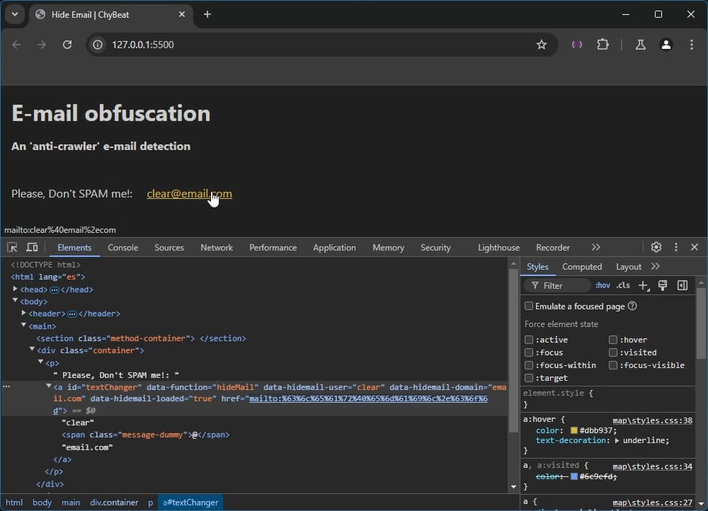

# Hide / Obfuscate E-mail

The file `hidemail.js` was created with the idea to obfuscate from web crawlers to avoid SPAM mails in mailto: declared HTML anchors.

# Index:

[The problem](#the-problem)

[How to use](#how-to-use)

[How it wotks](#how-it-wotks)

[Three methods to deal with](#three-methods-to-deal-with)

[A - Populating HTML attributes](#a---populating-html-attributes)

[B - Instantiate with embed object](#instantiate-with-embed-object)

[C - Instantiate with external object](#instantiate-with-external-object)

[Class methods](#class-methods)

[Class properties](#class-properties)

---

## The problem

If your website have an anchor like this: 
```html
<a href="mailto:clear@email.com">clear@email.com</a>
```
The mail inbox receive a lot of SPAM quickly!.

## How to use

This project can be used in [three ways](#three-methods-to-deal-with) (methods) to achieve this. The way you can embed the code (class block and instance) on any webpage may vary.

1. Add a `script` tag in HTML head's tag:
	```html
	<!DOCTYPE html>
	<html lang="es">
	<head>
		<meta charset="UTF-8">
		<meta name="viewport" content="width=device-width, initial-scale=1.0">
		<title>My Page</title>
		...
		
		<script src="/path/to/hidemail.js"></script>

	</head>
	<body>
		<a id="textChanger" href="https://anysite.com">https://anysite.com</a>
	</body>
	```
1. Initialize the class when the page was lodaded (recomended)
	```JavaScript
	document.addEventListener('DOMContentLoaded', function () {
		const nospam = new hideMail({
			user: "clear",
			domain: "gmail.com",
			anchor: document.querySelector("#textChanger")
		})
	})
	```
	_This example uses the [instantiate with embed object](#b---instantiate-with-embed-object) method._

## How it wotks

Changing/populating the `href=""` attribute of an anchor (`<a>`) with obfuscated `mailto:` data  when click or tap ('mouseover' action).

### 
You can watch and explore a live version of this project [here](https://chybeat.github.io/hidemail/):

### Video
Click the next image to watch a video (youtube) running hidemail class.

[](https://www.youtube.com/watch?v=juOxz6u-XKc)

## Three methods to deal with

This project has three methods to get results, the table below explains its properties.

| Property | Description                                      | Example HTML                       | Example Javascrip                    |
| -------- | ------------------------------------------------ | ---------------------------------- | ------------------------------------ |
| anchor   | The anchor node                                  | -- Not supported -- [^1]           | `document.getElementById("my-mail")` |
| domain   | Domain for the e-mail adress                     | `data-hidemail-domain="email.com"` | `domain: "email.com"`                |
| function | Indicate use of hidemail function to this anchor | `data-function="hidemail"`         | -- Not supported -- [^2]             |
| user     | Local part of e-mail                             | `data-hidemail-user="clear"`       | `user: "clear"`                      |

[^1]: In HTML the `anchor` porperty is not required, this is why the `data-function="hidemail"` was added.

[^2]: In JavaScript the `function` property is not required, is used in HTML to search from hidemail class for anchors.

### A - Populating HTML attributes

You need to add `data-` attributes to HTML anchor tag, in JavaScript, you only need instantiate the class `hidemail`

**HTML:**
```html
<a id="textChanger" data-function="hideMail" data-hidemail-user="clear" data-hidemail-domain="email.com"></a>
```

**JavaScript:**
```JavaScript
new hideMail()
```

Please note:
- If more anchor tags have all `data-` attributes (function, user and domain), all of them will be instantiated and/or changed[^3] in one run.
- The anchor has not `href` attribute. It will be filled with `window.location.origin` (current domain).
- No text into anchor tag. It will be filled with e-mail information (`user + '@' + domain`).

[^3]: When `new hideMail()` without an object is triggered, the constructur will search for any anchor with 'data-function="hideMail"' attribute: `document.querySelectorAll('a[data-function="hideMail"]')`
### B - Instantiate with embed object
You need to add the basic html anchor tag with id or class attribute and generate a JavaScript object.

**HTML:**
```html
<a id="textChanger"></a>
```

```JavaScript
new hideMail({
	user: "no-spam",
	domain: "example.com",
	anchor: document.getElementById("textChanger")
})
```

### C - Instantiate with external object

Runs the same way as [instantiate with embed object](#instantiate-with-embed-object), but to works, requires the `add()` function.

```JavaScript
const mail = new hideMail({})
const info = {
	user: "no-spam",
	domain: "example.com",
	anchor: document.querySelector("#textChanger")
}
mail.add(info)
```

Please note:

- If more anchor tags has all `data-` attributes, occurs same effects as in [populating HTML attributes](#a---populating-html-attributes)


# Class methods

The class hidemail has some methods, but the only one you really need is the `add` method, may be `enc` will be useful. You can read about all methods here only for your knowledge.

- ### add()
	Paramters: nodeElement

	Description: Adds or changes HTML anchor's  `data-` attributes, sets the anchor property with nodeElement and trigger the function `setData()`

	Example:
	```JavaScript
	add(node)
	```

- ### constructor()
	Parameter: object or nodeElement
	
	Description: Initialize the bind functions and the anchor elements.

	Example: (this function runs at the time of class instantiation)
	```javascript
	 new hidemail()
	 ```

- ### die()
	Parameters: string and array of string

	Description: Ends the class execution if error occurs.

	Example:
	```javascript
	die("Error found",["Not command.","Empty data"])
	```

- ### enc()
	Parameter: string

	Description: Encode a string to URL friendly/obfuscated data.

	Example: (Using the example instance used in this documentation)
	```javascript
	console.log(mail.enc("nospam@midomain.com"))
	/*Result: %6e%6f%73%70%61%6d%40%6d%69%64%6f%6d%61%69%6e%2e%63%6f%6d*/ 
	```

- ### setData()
	Parameter: none

	Description: Uses the achor property of the class to generate and populate some class information, anchor HTML attributes and mouse action triggers (over and out).

	Example:
	```javascript
	setData()
	```

- ### setHref()
	Parameter: none

	Description: Sets the obfuscated text on anchor's href attribute when 'mouseover' event triggered

	Example:
	```javascript
	setHref()
	```

- ### setDefaultHref()
	Parameter: none

	Description: Sets the current (generated if empty on html code) in the anchor href attribute when 'mouseout' event triggered

	Example:
	```javascript
	setDefaultHref()
	```

- ### searchError()
	Parameter: nodeElement

	Description: Search for errors or empty requiered properties in dataset passed node. Aditionally heres where the href attribute and anchors content text will be filled with `window.location.origin` if empty. Also uses the `die()` function to show errors if they occur.

	Example:
	```javascript
	searchError(node)
	```

# Class properties

- ### character_set
	Type: array

	Description: contains the possible ways of `@` used in HTML/URL

	Default: `character_set = ['&#64', '%40', '@'];`

- ### anchor
	Type: String or nodeElement

	Description: Uset to store the nodeElement for the current instance

	Default: ` anchor = ''; `

- ### user
	Type: String

	Description: Stores the local part of e-mail

	Default:`user = "";`

- ### domain
	Type: String

	Description: Stores the domain of the e-mail address

	Default:`domain = "";`

- ### originalHref
	Type: String

	Description: Used to store the current href information on anchor (or generated if empty). Is the text in href attribute while not mouse over.

	Default: `originalHref = "";`

- ### address

	Type: String

	Description: Stores the target e-mail address to 'protect'. This will be filled into anchor's tag when mouse is over
	
	Default:` address = "";`

---
Created by ChyBeat

[](https://creativecommons.org/licenses/by-sa/4.0/)

Creative commons license: [CC BY-SA 4.0](https://creativecommons.org/licenses/by-sa/4.0/) (Attribution-ShareAlike 4.0 International)
